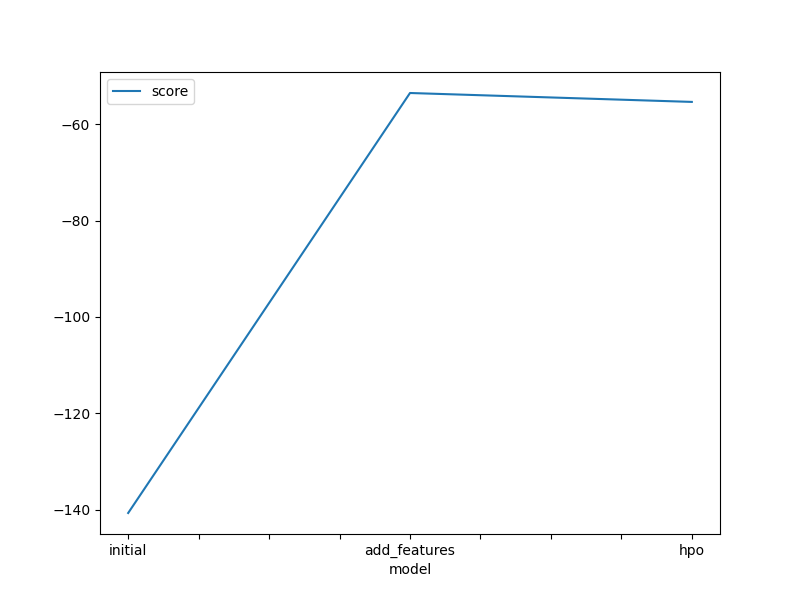
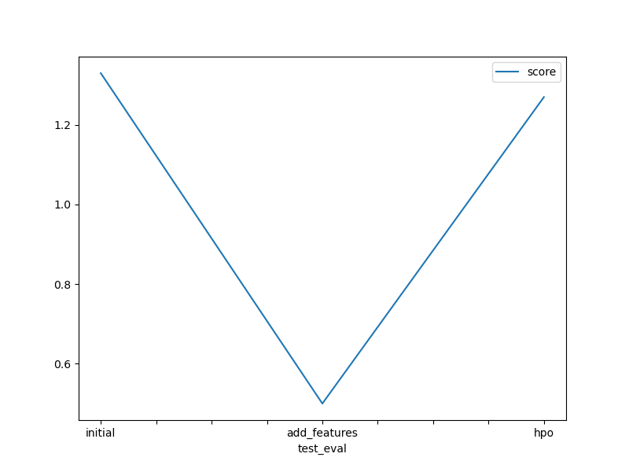

# Report: Predict Bike Sharing Demand with AutoGluon Solution
#### Catarina Dias

## Initial Training
### What did you realize when you tried to submit your predictions? What changes were needed to the output of the predictor to submit your results?
To submit the predictions in Kaggle I had to change the negative predictions to 0. Afterwards, I could submit the predictions successfully.

### What was the top ranked model that performed?
The top ranked model was a Weighted Ensemble L3 obtained after feature engineering but without hypterparameter tunning. The Weighted Ensemble L3 is a model weighted ensemble that returns a weighted sum of the predictions of individual models at Level 2 (L2). The goal of the L3 ensemble is to further improve performance by combining the strengths of different L2 ensembles.
In the test set this model achieved a MSE of 0.50.

## Exploratory data analysis and feature creation
### What did the exploratory analysis find and how did you add additional features?
I started by getting an overview of the dataset by checking:
- The shape of the dataset: 10886 rows in the training set and 6493 rows in the test set. Both sets with 9 columns after dropping casual and registered columns and the label from the training set.
- The number of missing values: No missing values.
- If the datasets had any duplicated rows: No duplicated rows.
- The fields data types.

After that, I converted the datetime filed into new columns: month, day, week day and hour. With the new fields, I plotted how the bike rental demand changed with the breakdown of some of the available field. The main findings were the following:
1. The bike rental demand is higher during rush hours: 7h-9h and 17h-19h.
2. The bike rental demand is lower between November and April.
3. The demand is higher in fall and lower during spring.
4. The demand is higher dring warm temperatures / low humidity levels.

Based on these findings, I added the following additional features:
1. One-hot encoded season and weather, so models know they are not just numbers but that they represent categories.
2. Parse datetime into month, day, week day and hour.
3. Create the rush_hour boolean variable that is 1 during 7h-9h and 17h-19h. 

### How much better did your model preform after adding additional features and why do you think that is?
After adding additional features, the model MSE improved from 1.33 to 0.50. Adding new features, that are good indicators of the value to predict, help in the training process and thus improve the model performance. Also, before the one-hot encoding operation the model was considering the season and weather fields as integers which might have harmed the model performance.

## Hyper parameter tuning
### How much better did your model preform after trying different hyper parameters?
In the hyperparameter tuning iterations the performance of the models decreased. This can probably be explained by a bad definition of the hyperparameters grid.

### If you were given more time with this dataset, where do you think you would spend more time?
If I had more time with this dataset, I would try to understand in more detail the different hyperparameters can AutoGluon offers (both AutoGluon higher level parameters and the individual model hyperparameters) and tune them in order to improve the performance. Given that the top models in all iterations were Weighted Ensemble models, I would invest more time trying to understand how I can tune these models and increase the running time limits of AutoGluon.

### Create a table with the models you ran, the hyperparameters modified, and the kaggle score.
|model|algorithm|hpo1|hpo2|hpo3|hpo4|score|
|--|--|--|--|--|--|--|
|initial|Weighted Ensemble L3|use_orig_features:False|max_base_models: 25|max_base_models_per_type: 5|save_bag_folds: True|1.33|
|add_features|Weighted Ensemble L3|use_orig_features:False|max_base_models: 25|max_base_models_per_type: 5|save_bag_folds: True|0.50|
|hpo|Weighted Ensemble L2|use_orig_features:False|max_base_models: 25|max_base_models_per_type: 5|save_bag_folds: True|1.27|

### Create a line plot showing the top model score for the three (or more) training runs during the project.

TODO: Replace the image below with your own.

### Create a line plot showing the top kaggle score for the three (or more) prediction submissions during the project.

TODO: Replace the image below with your own.

## Summary
Goal of this project
In this project we developed a model to predict bike sharing demand combining historical usage patterns with weather data. It is important to accurately estimate the demand of bike rentals so that the companies responsible can effeciently manage the bike stocks and improve customer experience.

Data exploratory analysis conclusions
The demand of bike rentals is highly correlated with weather conditions and rush hours. As expected, the demand is higher during warm seasons (summer and fall) and during rush hours (7h-9h and 17h-19h) for commuting from home to work and vice versa.

Achievements
The model with better performance was an Weighted Ensemble L3 model that achieved a MSE of 0.50.

Future improvements
There is still a lot of space for improvement specially in feature engineering and hyperparameter tuning. During hyperparameter tuning experiences, there was not an improvement in the model performance so the hyperparameters can be further optimized and other algorithms can be tested.